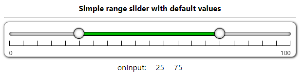
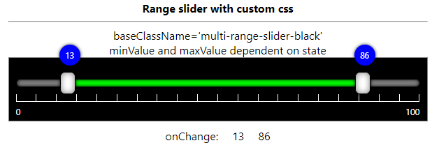
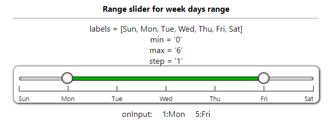
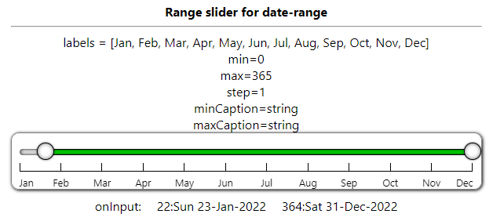
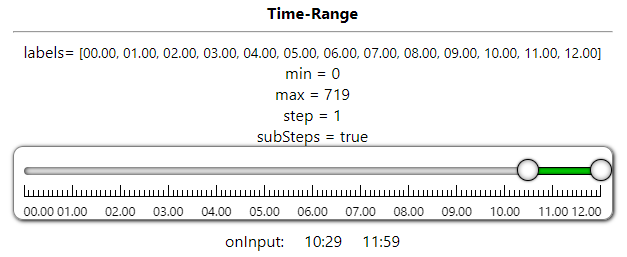
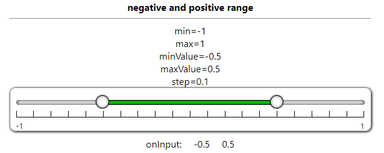
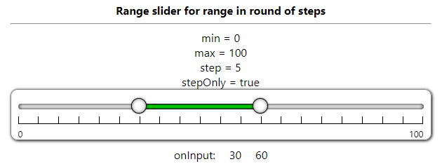
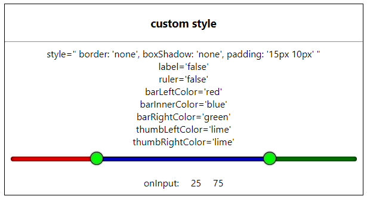

# simple-range-slider-nextjs

a react component compatible with Next.js that can easy to use and interact with parent component with props and events.

------------

## Image examples.

------------

# No Dependency only single component file and css file 

## SimpleRangeSlider.jsx , SimpleRangeSlider.css

### You can customize css to change UI/UX.

Download CSS file and modify it and reference it with baseClassName attribute

[simplerangeslider.css](https://raw.githubusercontent.com/mateuscardosogs/simple-range-slider-nextjs/main/src/components/simplerangeslider.css)

[multirangesliderblack.css](https://raw.githubusercontent.com/mateuscardosogs/simple-range-slider-nextjs/main/src/components/multirangesliderblack.css)

Following is the list of props that control the component 

|props   | type | default | description | 
| ------------ | ------------ | ------------ | ------------ |
| min  | Number  | 0 | Slider Minimum Value that user can set |
| max  | Number  | 100 | Slider Maximum Value that user can Set |
| minValue  | Number  | 25 | Slider range selected minimum value that will show default selected |
| maxValue  | Number  | 75 | Slider range selected maximum value that will show default selected |
| step  | Number  | 5 | Slider change value that will change when bar clicked or keyboard arrow key pressed |
| stepOnly  | Boolean  | false | specify user to select only values in round of step only |
| preventWheel  | Boolean  | false | true then it not accept mouse wheel to change its value. false then (shift + wheel) change minValue (ctrl+wheel) change maxValue, (ctrl+shift+wheel) change both values |
|ruler|Boolean|true|is ruler visible or not|
|label|Boolean|true|is label visible or not|
|labels|String Array||specify steps label string value|
|minCaption|String||caption on min thumb when sliding - can set on onChange/onInput event|
|maxCaption|String||caption on max thumb when sliding - can set on onChange/onInput event|
|subSteps|Boolean|false|is small steps line visible or not|
|baseClassName|String|simple-range-slider|Change CSS style of your own|
|className|String|''|Add additional class with baseClassName to div.simple-range-slider|
|style|React.CSSProperties||specify/override additional style on div.simple-range-slider|
|barLeftColor|String-Color||specify slider left part background color|
|barRightColor|String-Color||specify slider right part background color|
|barInnerColor|String-Color||specify slider inner part background color|
|thumbLeftColor|String-Color||specify slider left thumb background color|
|thumbRightColor|String-Color||specify slider right thumb background color|
|ref|React.useRef||reference to div.simple-range-slider|

### Event List

|Event|Description|
|-|-|
|onChange|trigger when thumb mouse up OR slider value change done|
|onInput|trigger on thumb mouse move OR slider value changing|

### typescript props definition 

	Props = {
		min?: number | string;
		max?: number | string;
		step?: number | string;
		minValue?: number | string;
		maxValue?: number | string;
		baseClassName?: string;
		className?: string;
		style?: React.CSSProperties;
		ruler?: boolean | string;
		label?: boolean | string;
		subSteps?: boolean | string;
		stepOnly?: boolean | string;
		preventWheel?: boolean | string;
		labels?: string[];
		minCaption?: string;
		maxCaption?: string;
		barLeftColor?: string;
		barRightColor?: string;
		barInnerColor?: string;
		thumbLeftColor?: string;
		thumbRightColor?: string;
		onInput?: (e: ChangeResult) => void;
		onChange?: (e: ChangeResult) => void;
	};

### onInput/onChange event parameter type - typescript
	type ChangeResult = {
		min: number;
		max: number;
		minValue: number;
		maxValue: number;
	};

## How to Install
copy following code and run on CLI

`npm install simple-range-slider-nextjs`

## How to use 
Example Code 

#### App.jsx

	import React, { useState } from "react";
	import SimpleRangeSlider from "simple-range-slider-nextjs";
	function App() {
	const [minValue, set_minValue] = useState(25);
	const [maxValue, set_maxValue] = useState(75);
	const handleInput = (e) => {
		set_minValue(e.minValue);
		set_maxValue(e.maxValue);
	};

	return (
		

			<SimpleRangeSlider
				min={0}
				max={100}
				step={5}
				minValue={minValue}
				maxValue={maxValue}
				onInput={(e) => {
					handleInput(e);
				}}
			/>
		

		);
	}

	export default App;

  

#### App.tsx

	import React, { useState } from "react";
	import SimpleRangeSlider, { ChangeResult } from "simple-range-slider-nextjs";

	const App = () => {
		const [minValue, setMinValue] = useState(25);
		const [maxValue, setMaxValue] = useState(75);

		return (
			

				

					<b>Simple range slider with default values</b>
					

					<SimpleRangeSlider
						min={0}
						max={100}
						step={5}
						minValue={minValue}
						maxValue={maxValue}
						onInput={(e: ChangeResult) => {
							setMinValue(e.minValue);
							setMaxValue(e.maxValue);
						}}
					></SimpleRangeSlider>
					

						
onInput:

						
{minValue}

						
{maxValue}

					

				

			

		)
	
	}
	export default App;
	
